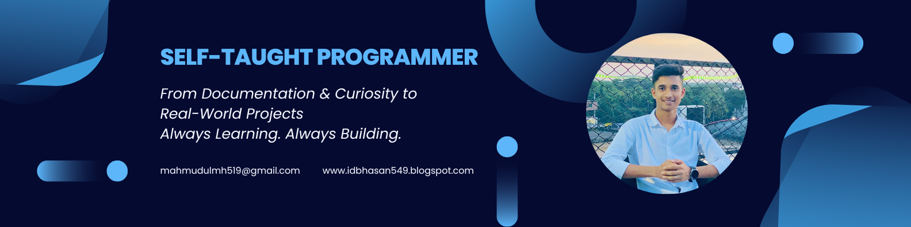

<h1 align="center">Hi, I'm Mahmudul Hasan</strong></h1>
<h3 align="center">💻 Full Stack Web Developer 🌐 Building scalable web applications 🚀 Frontend | Backend | Database </h3>

  Social <a href="https://linkedin.com/in/tapasadhikary">LinkedIn</a> |
  <a href="https://x.com/IdbTechnol89109">Twitter</a> |
  <a href="https://idbhasan549.blogspot.com/">🌐 Website</a>

## About Me

I’m **Mahmudul Hasan**, a *self-taught Full Stack Web Developer* passionate about building modern, responsive, and user-friendly web applications. Through continuous self-learning and hands-on project development,, I have built a strong foundation in both *Frontend and Backend Web Development*.

I enjoy solving problems with code, learning new technologies, and turning ideas into functional web applications. My long-term goal is to continue improving my development skills and grow as a professional *Software Engineer*.

## 🚀 Skills & Technologies

### 🎨 Frontend Development

* HTML5
* CSS3
* JavaScript (ES6+)
* React.js
* Bootstrap
* Tailwind CSS
* Responsive Web Design
* DOM Manipulation
* Event Handling
* API Integration

### ⚙️ Backend Development

* Node.js
* Express.js
* Python
* Django
* Flask
* FastAPI
* REST API Development

### 🗄️ Database

* MySQL
* Database Management
* CRUD Operations

### 🛠️ Tools & Development

* Git
* GitHub
* VS Code
* npm / Yarn
* Vite
* Chrome DevTools

### 💡 Core Development Skills

* Problem Solving
* Object-Oriented Programming
* Asynchronous JavaScript
* Promises & Async/Await
* Fetch API
* Local Storage
* API Integration
* Debugging
* Clean & Maintainable Code

## 💬 Let's `Connect`

I'm always open to connecting with fellow developers, collaborating on interesting projects, and exploring new opportunities in web development.

📧 Email       : mahmudulmh519@gmail.com  
🌐 Website      : https://idbhasan549.blogspot.com  
💼 LinkedIn: https://www.linkedin.com/in/md-hasan-b83947355

## 📚 My Learning Journey

I started my journey as a *self-taught developer, learning through online resources, documentation, tutorials, and hands-on projects. Instead of only learning theory, I focus on **practical problem-solving and building real-world projects*.

> *Learn → Practice → Build → Improve → Repeat 🚀*

I'm continuously learning, building projects, and improving my skills as a Full Stack Web Developer.
